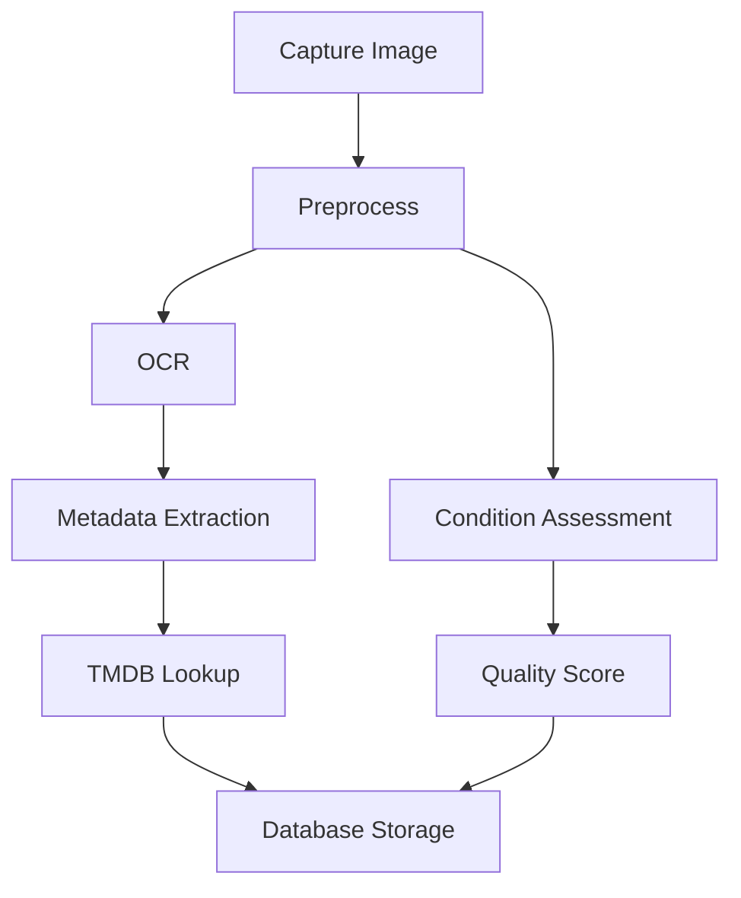

# Current Direction

## Immediate Focus Areas

### 1. TMDB Integration Enhancement
- Complete API client error handling
- Implement robust caching system
- Add fuzzy matching for movie titles
- Create manual override interface for ambiguous matches

### 2. OCR System Improvement
- Implement additional preprocessing filters for better text recognition
- Create custom training data for VHS tape text formats
- Add confidence scoring for extracted text
- Build manual correction interface for low-confidence results

### 3. Database Implementation
**Priority: High**
```sql
-- Key tables to implement
CREATE TABLE media_items (
    id SERIAL PRIMARY KEY,
    type VARCHAR(50),
    title VARCHAR(255),
    year INTEGER,
    condition VARCHAR(50),
    weight DECIMAL,
    created_at TIMESTAMP,
    updated_at TIMESTAMP
);

CREATE TABLE listing_details (
    id SERIAL PRIMARY KEY,
    media_item_id INTEGER REFERENCES media_items(id),
    platform VARCHAR(50),
    listing_id VARCHAR(255),
    price DECIMAL,
    status VARCHAR(50),
    created_at TIMESTAMP
);

CREATE TABLE processing_results (
    id SERIAL PRIMARY KEY,
    media_item_id INTEGER REFERENCES media_items(id),
    ocr_text TEXT,
    confidence DECIMAL,
    metadata JSONB,
    debug_image_path VARCHAR(255)
);
```

### 4. Hardware Integration Planning
1. Camera Module
   ```python
   class CameraController:
       def __init__(self):
           self.camera = None
           self.resolution = (1920, 1080)
           self.auto_focus = True
           
       async def capture(self) -> np.ndarray:
           # Implementation coming soon
           pass
           
       def adjust_settings(self):
           # Implementation coming soon
           pass
   ```

2. Scale Integration
   ```python
   class ScaleInterface:
       def __init__(self, port: str):
           self.port = port
           self.connection = None
           
       async def get_weight(self) -> float:
           # Implementation coming soon
           pass
   ```

## Technical Decisions

### 1. Database Selection
- **Choice**: PostgreSQL
- **Reasoning**: 
  - Robust JSONB support for flexible metadata
  - Strong performance with large datasets
  - Rich querying capabilities
  - Free and open-source

### 2. Image Processing Pipeline


### 3. API Integration Strategy
- Implement rate limiting
- Use caching aggressively
- Implement retry mechanisms
- Create fallback workflows

### 4. Testing Strategy
1. Unit Tests
   - Core processing functions
   - API integrations
   - Database operations

2. Integration Tests
   - End-to-end workflows
   - Hardware integration
   - API communication

3. Performance Tests
   - Processing speed
   - Database operations
   - API response times

## Next Development Sprint

### Priority Tasks
1. [ ] Set up PostgreSQL database
2. [ ] Enhance TMDB integration
3. [ ] Improve OCR accuracy
4. [ ] Start camera integration

### Timeline
- Database setup: 2 days
- TMDB enhancement: 3 days
- OCR improvements: 4 days
- Camera integration: 3 days

### Success Criteria
1. Database can store and retrieve all necessary data
2. TMDB lookups achieve >90% accuracy
3. OCR accuracy improves to >85%
4. Camera can be controlled programmatically
