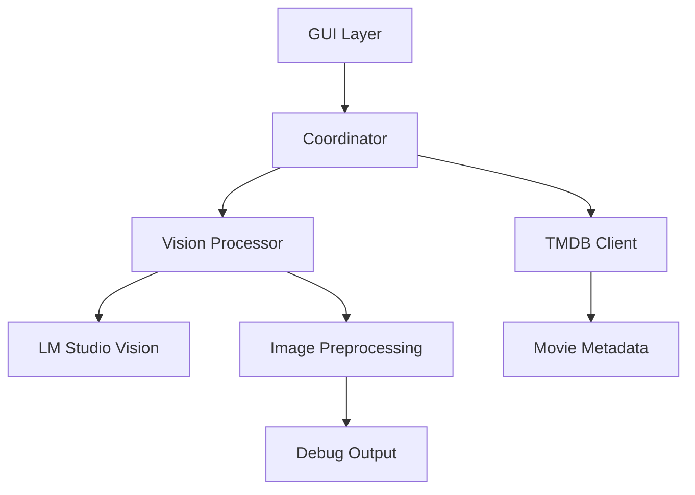

# Project Context

## Overview
VHS Tape Scanner is a Python application for digitizing and cataloging VHS tape collections. It combines computer vision, OCR, and movie database integration to extract and verify tape information.

## Core Components

### Vision Processing
- Using LM Studio vision model for text extraction
- Adaptive image preprocessing pipeline
- Confidence-based validation
- Debug visualization at each step

### GUI Interface
- PyQt-based main window
- Image preview with zoom/pan
- Results view with confidence scores
- Debug visualization tab
- Settings management

### Movie Data Integration
- TMDB API integration for metadata
- Intelligent title matching
- Year/runtime verification
- Cover art comparison (planned)

### Data Management
- JSON export of results
- Debug image storage
- Processing logs
- Auto-save capability

## Current Architecture

## Development Status

### Recent Updates
- Migrated to LM Studio vision model
- Enhanced preprocessing pipeline
- Improved result confidence scoring
- Added debug visualization
- Updated GUI for new result format

### Current Focus
- Improving OCR accuracy
- Enhancing error handling
- Optimizing image preprocessing
- Adding batch processing

### Known Limitations
1. Vision Processing
   - Requires LM Studio to be running
   - Limited cursive font handling
   - Memory intensive for large images

2. Integration
   - Manual TMDB API key setup
   - No offline mode
   - Limited error recovery

3. User Experience
   - Basic keyboard shortcuts
   - Limited progress feedback
   - No undo/redo

## Configuration

### Required Environment Variables
- `LM_STUDIO_HOST`: LM Studio API endpoint
- `LM_STUDIO_MODEL`: Vision model name
- `TMDB_API_KEY`: TMDB API authentication
- `DEBUG`: Enable debug output
- `DEBUG_VISION`: Enable vision debug images

### Optional Settings
- `CAMERA_INDEX`: Default camera device
- Auto-save preferences
- Debug visualization options

## Testing Strategy

### Automated Tests
- Unit tests for core components
- Integration tests for API clients
- GUI testing (in progress)

### Manual Testing
- OCR accuracy verification
- Performance benchmarking
- UX testing

## Next Steps
See [roadmap.md](roadmap.md) for detailed development plans.
